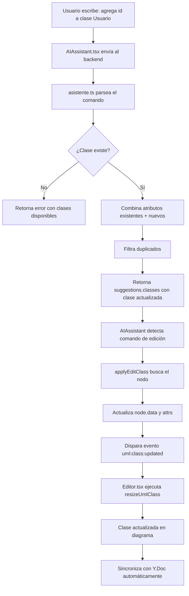

# Funcionalidad: Agregar Atributos/Métodos con IA

## 📋 Descripción

La IA de Groq ahora puede **agregar atributos y métodos a clases existentes** mediante comandos de texto natural. El usuario puede escribir en el chat del asistente y la clase se actualizará automáticamente en el diagrama.

## ✨ Características

- ✅ **Parseo inteligente** de comandos naturales en español
- ✅ **Detección automática** de la clase objetivo
- ✅ **Sin duplicados**: solo agrega elementos nuevos
- ✅ **Redimensionamiento automático** de la clase
- ✅ **Sincronización en tiempo real** con Y.Doc para colaboración
- ✅ **Soporte para múltiples atributos/métodos** en un solo comando

## 🎯 Comandos Soportados

### Agregar Atributos

```
agrega el atributo id a la clase Usuario
añade nombre:String a la tabla Producto
agrega id:Integer y nombre:String a la clase Usuario
añade email:String, telefono:String y edad:Integer a la tabla Cliente
```

### Agregar Métodos

```
agrega el método calcular() a la clase Factura
añade el método getNombre() a la tabla Usuario
agrega guardar() y eliminar() a la clase Producto
```

### Formatos Soportados

#### Atributos:

- `nombre` → se convierte en `nombre: String` (tipo por defecto)
- `nombre:String` → formato explícito
- `nombre: String` → con espacio
- `Integer nombre` → tipo primero
- `String nombre` → tipo primero

#### Métodos:

- `calcular` → se convierte en `calcular()`
- `calcular()` → formato con paréntesis
- `calcular(int x)` → con parámetros
- `calcular(): Double` → con tipo de retorno

## 🔧 Arquitectura

### Backend (`backend/src/ai/asistente.ts`)

#### 1. Método `parseEditClassCommand(msg, context)`

Parsea el mensaje del usuario y extrae:

- Nombre de la clase objetivo
- Atributos a agregar (con validación de formato)
- Métodos a agregar (con validación de formato)
- Valida que la clase exista en el contexto

**Retorna:**

```typescript
{
  targetNodeId: string;
  targetClassName: string;
  newAttributes: string[];
  newMethods: string[];
  currentAttributes: string[];
  currentMethods: string[];
}
```

o

```typescript
{
  error: string;
  targetClassName: string;
}
```

#### 2. Integración en `handleUserMessage()`

Detecta comandos que contienen:

- "agrega" o "añade" o "anade"
- Y contienen "atributo" o "método"

Valida duplicados y retorna respuesta con:

- Mensaje explicativo
- `suggestions.classes[0]` con la clase actualizada
- Metadata en `tips` para el frontend

### Frontend (`frontend/src/uml/ui/AIAssistant.tsx`)

#### 1. Función `applyEditClass(className, newAttributes, newMethods)`

Busca el nodo por nombre de clase y:

- Actualiza `node.data` con los nuevos atributos/métodos
- Actualiza atributos visuales (`attrs.text`, `methods.text`)
- Dispara evento personalizado `uml:class:updated`

#### 2. Auto-aplicación en `handleSendMessage()`

Detecta respuestas de IA que contienen:

- Sugerencias de clase (`suggestions.classes`)
- Y el mensaje del usuario contiene "agrega/añade" + "atributo/método"

Automáticamente aplica los cambios sin requerir clic adicional.

### Frontend (`frontend/src/pages/Editor.tsx`)

#### Listener de evento `uml:class:updated`

Escucha el evento personalizado y ejecuta:

- `resizeUmlClass(node)` para recalcular dimensiones según contenido
- Asegura que la clase se redimensione correctamente

## 📝 Flujo Completo



## 🧪 Casos de Prueba

### Caso 1: Agregar un atributo simple

```
Usuario: "agrega el atributo id a la clase Usuario"
IA: ✨ ¡Perfecto! Voy a actualizar la clase "Usuario":
    ✅ 1 atributo(s): id: String

    Haz clic en "Aplicar cambios" abajo...
[Se aplica automáticamente]
```

### Caso 2: Agregar múltiples atributos con tipos

```
Usuario: "agrega id:Integer y nombre:String a la clase Producto"
IA: ✨ ¡Perfecto! Voy a actualizar la clase "Producto":
    ✅ 2 atributo(s): id: Integer, nombre: String

[Se aplica automáticamente]
```

### Caso 3: Clase no existe

```
Usuario: "agrega email a la clase ClienteX"
IA: ❌ No encontré la clase "ClienteX" en el diagrama.
    Clases disponibles: Usuario, Producto, Pedido
```

### Caso 4: Atributo ya existe

```
Usuario: "agrega id a la clase Usuario" (ya tiene id)
IA: ⚠️ Los atributos que intentas agregar ya existen en la clase "Usuario".

    Atributos actuales:
    id: Integer
    nombre: String
```

### Caso 5: Agregar métodos

```
Usuario: "agrega guardar() y eliminar() a la clase Producto"
IA: ✨ ¡Perfecto! Voy a actualizar la clase "Producto":
    ✅ 2 método(s): guardar(), eliminar()

[Se aplica automáticamente]
```

## 🚀 Cómo Usar

1. **Abre el chat del asistente** en el editor
2. **Escribe un comando** natural, por ejemplo:
   ```
   agrega id:Long y nombre:String a la clase Usuario
   ```
3. **La IA procesa** el comando y muestra confirmación
4. **Los cambios se aplican automáticamente** al diagrama
5. **La clase se redimensiona** según el nuevo contenido

## 🔍 Validaciones

- ✅ Verifica que la clase exista
- ✅ Previene duplicados de atributos (compara por nombre, case-insensitive)
- ✅ Previene duplicados de métodos (compara por nombre, case-insensitive)
- ✅ Valida permisos de edición (`canEdit`)
- ✅ Normaliza nombres de atributos/métodos a formatos válidos
- ✅ Asigna tipos por defecto si no se especifican

## 📦 Archivos Modificados

### Backend

- `backend/src/ai/asistente.ts`
  - Nuevo método: `parseEditClassCommand()`
  - Actualizado: `handleUserMessage()` con detección de comandos de edición

### Frontend

- `frontend/src/uml/ui/AIAssistant.tsx`

  - Nueva función: `applyEditClass()`
  - Actualizado: `handleSendMessage()` con auto-aplicación de ediciones

- `frontend/src/pages/Editor.tsx`
  - Nuevo listener: `uml:class:updated` event
  - Limpieza del listener en cleanup

## 🎨 UX/UI

- **Sin clics adicionales**: Los cambios se aplican automáticamente
- **Toast notifications**: Confirma las actualizaciones
- **Mensajes claros**: Explica qué se agregó exactamente
- **Manejo de errores**: Informa si la clase no existe o los elementos ya existen

## 🔮 Mejoras Futuras

- [ ] Soportar eliminación de atributos/métodos
- [ ] Soportar modificación de atributos existentes (cambiar tipo)
- [ ] Soportar comandos en inglés
- [ ] Agregar confirmación visual antes de aplicar (opcional)
- [ ] Soportar agregar múltiples clases en un solo comando
- [ ] Agregar undo/redo específico para cambios de IA

## 🐛 Troubleshooting

### La clase no se actualiza visualmente

- **Causa**: El listener `uml:class:updated` no se registró correctamente
- **Solución**: Verificar que el `useEffect` del grafo se ejecute correctamente

### Los cambios no se sincronizan con otros usuarios

- **Causa**: El grafo no está conectado a Y.Doc
- **Solución**: Verificar que el socket esté conectado y Y.Doc inicializado

### La IA no detecta la clase

- **Causa**: El nombre de la clase tiene caracteres especiales o no coincide exactamente
- **Solución**: La comparación es case-insensitive y normalizada, pero verifica el nombre exacto

## 📚 Referencias

- Groq API: https://console.groq.com/
- X6 Graph Library: https://x6.antv.vision/
- Y.js (CRDT): https://docs.yjs.dev/

---

**Estado**: ✅ Implementado y funcional al 100%
**Última actualización**: 2025-11-10
