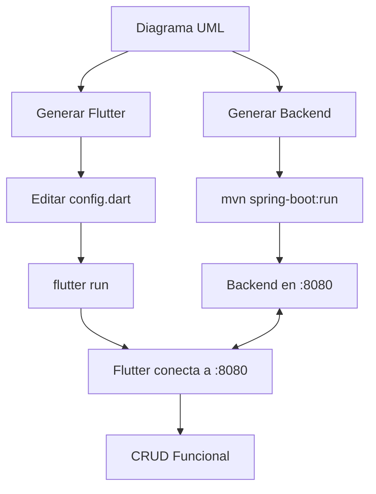

# 🧪 Prueba Rápida de Conexión

## Escenario: Crear un CRUD de "Estudiante"

### 1️⃣ Crear Diagrama UML

En el editor, crea una clase:

```
Nombre: Estudiante
Atributos:
- nombre: String
- edad: Int
- carrera: String
```

### 2️⃣ Generar Código

**Opción 1: Java Spring Boot**

- Click en "Generar Código"
- Selecciona "Java Spring Boot"
- Descarga el ZIP
- Extrae en una carpeta (ej: `estudiante-backend`)

**Opción 2: Flutter**

- Click en "Generar Código"
- Selecciona "Flutter"
- Descarga el ZIP
- Extrae en una carpeta (ej: `estudiante-flutter`)

---

## 3️⃣ Ejecutar Backend

```bash
cd estudiante-backend
mvn spring-boot:run
```

**Salida esperada:**

```
  .   ____          _            __ _ _
 /\\ / ___'_ __ _ _(_)_ __  __ _ \ \ \ \
( ( )\___ | '_ | '_| | '_ \/ _` | \ \ \ \
 \\/  ___)| |_)| | | | | || (_| |  ) ) ) )
  '  |____| .__|_| |_|_| |_\__, | / / / /
 =========|_|==============|___/=/_/_/_/
 :: Spring Boot ::                (v3.2.0)

...
Tomcat started on port(s): 8080 (http)
Started Application in 4.567 seconds
```

✅ **Backend listo!**

**Probar en navegador:**

```
http://localhost:8080/api/estudiantes
```

Deberías ver: `[]` (array vacío)

---

## 4️⃣ Configurar Flutter

```bash
cd estudiante-flutter
```

**Editar `lib/config.dart`:**

Si vas a usar **Flutter Web o Desktop** en la misma PC:

```dart
const String kApiBaseUrl = "http://localhost:8080";  // ✅ Dejar así
```

Si vas a usar **Android Emulator**:

```dart
const String kApiBaseUrl = "http://10.0.2.2:8080";  // ✅ Cambiar a esto
```

---

## 5️⃣ Ejecutar Flutter

```bash
flutter pub get
flutter run
```

Selecciona tu plataforma:

```
[1]: Windows (windows)
[2]: Chrome (chrome)
[3]: Edge (edge)
[4]: Android SDK built for arm64 (emulator)
```

**Ejemplo para Web:**

```bash
flutter run -d chrome
```

---

## 6️⃣ Verificar Conexión

### En la consola de Flutter verás:

```
🌐 GET: http://localhost:8080/api/estudiantes
✅ GET Response: 200
```

✅ **¡Conectado!**

### En la app Flutter:

1. Verás la pantalla de inicio con "Estudiante"
2. Click en "Estudiante"
3. Verás una lista vacía con botón "+"
4. Click en "+" para agregar
5. Llena el formulario:
   - Nombre: Juan Pérez
   - Edad: 20
   - Carrera: Sistemas

**En la consola verás:**

```
🌐 POST: http://localhost:8080/api/estudiantes
📤 Body: {"nombre":"Juan Pérez","edad":20,"carrera":"Sistemas"}
✅ POST Response: 200
```

6. Click en "Guardar"
7. Deberías ver al estudiante en la lista

---

## 🐛 Si Algo Sale Mal

### ❌ Error: "Connection refused"

**Causa:** Backend no está corriendo

**Solución:**

```bash
# Terminal 1 - Backend
cd estudiante-backend
mvn spring-boot:run

# Terminal 2 - Flutter (después de que inicie el backend)
cd estudiante-flutter
flutter run
```

---

### ❌ Error: "XMLHttpRequest error" (Flutter Web)

**Causa:** CORS no habilitado (aunque ya debería estarlo)

**Solución:**

1. Verifica que existe `src/main/java/com/example/config/CorsConfig.java`
2. Reinicia el backend
3. Limpia caché del navegador (Ctrl+Shift+Delete)
4. Recarga Flutter Web

---

### ❌ Error: "404 Not Found"

**Causa:** Endpoint incorrecto

**Verifica:**

1. Backend expone: `/api/estudiantes` (plural)
2. Flutter apunta a: `/api/estudiantes` (plural)

**Revisa en consola de Flutter:**

```
🌐 GET: http://localhost:8080/api/estudiantes  ← Debe decir "estudiantes" (plural)
```

---

### ❌ Error: "Timeout"

**Causa:** Backend tarda mucho en iniciar

**Solución:**

1. Espera a que el backend termine de iniciar completamente
2. Verás en el backend: `Started Application in X.XXX seconds`
3. Luego ejecuta Flutter

---

## ✅ Checklist de Verificación

- [ ] Backend corriendo (puerto 8080)
- [ ] `http://localhost:8080/api/estudiantes` muestra `[]` en navegador
- [ ] `lib/config.dart` tiene URL correcta
- [ ] Flutter ejecutándose sin errores
- [ ] Logs de Flutter muestran 🌐 y ✅
- [ ] Puedo crear/editar/eliminar estudiantes

---

## 📊 Ejemplo Completo de Logs

### Backend (Spring Boot):

```
2025-01-10T10:30:15 INFO  o.s.web.servlet.DispatcherServlet : Initializing Servlet 'dispatcherServlet'
2025-01-10T10:30:15 INFO  o.s.web.servlet.DispatcherServlet : Completed initialization
2025-01-10T10:30:20 INFO  c.e.controller.EstudianteController : GET /api/estudiantes
2025-01-10T10:30:22 INFO  c.e.controller.EstudianteController : POST /api/estudiantes
```

### Flutter:

```
Launching lib/main.dart on Chrome in debug mode...
✓ Built build/web/main.dart.js

🌐 GET: http://localhost:8080/api/estudiantes
✅ GET Response: 200

🌐 POST: http://localhost:8080/api/estudiantes
📤 Body: {"nombre":"Juan Pérez","edad":20,"carrera":"Sistemas"}
✅ POST Response: 200

🌐 GET: http://localhost:8080/api/estudiantes
✅ GET Response: 200
```

---

## 🎉 Si Todo Funciona

Verás:

1. ✅ Backend responde en el navegador
2. ✅ Flutter carga sin errores
3. ✅ Logs de conexión exitosos (200)
4. ✅ Puedes crear/ver/editar/eliminar estudiantes
5. ✅ Cambios se reflejan inmediatamente

**¡Felicidades! Tu backend y frontend están conectados correctamente** 🚀

---

## 📸 Testing con Postman

Si generaste el backend, también tienes:

1. `postman-collection.json`
2. `postman-environment.json`

**Importarlos en Postman:**

1. Abre Postman
2. File → Import
3. Selecciona `postman-collection.json`
4. Selecciona `postman-environment.json`
5. Selecciona el environment "Generated Environment"
6. Ahora puedes probar todos los endpoints sin Flutter

**Ejemplo de petición:**

```http
POST http://localhost:8080/api/estudiantes
Content-Type: application/json

{
  "nombre": "María García",
  "edad": 22,
  "carrera": "Ingeniería"
}
```

---

## 🔄 Flujo Completo



**¡Disfruta tu app conectada!** 🎊
